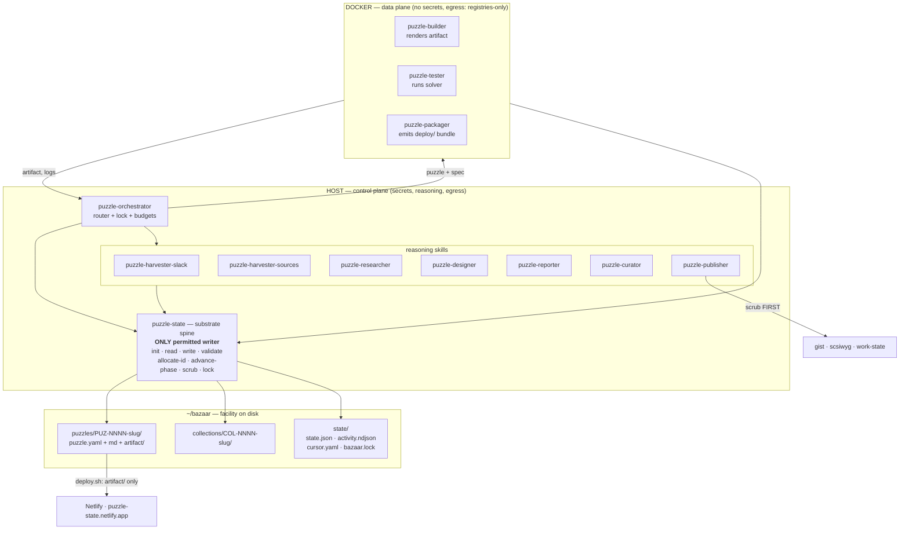

# puzzle-state Project Documentation — Report 01b: Technical Specification

> **Project:** puzzle-state | **Generated:** 2026-08-25 | **Repo:** worksona/puzzle-state (public)

## Executive Summary

puzzle-state specifies an agent pipeline as a set of Markdown contracts rather than as code: twelve `SKILL.md` files define a fixed eight-phase lifecycle over a file-per-entity YAML substrate, with a single-writer spine, a filesystem lock, and a host/container trust boundary that keeps generated puzzle code out of the host shell. This report gives the component architecture, the data shapes and their schema, the command surface, the deployment topology, the security model, and the decisions that shaped them — with their costs. The most consequential finding is that the schema is normative in text but unenforced in practice: three of eighteen live records carry `design.type` values the schema's enum forbids.

## Component Architecture

Three tiers, distinguished by what may write and what may execute.

### Tier 1 — the spine

`plugin/skills/puzzle-state/SKILL.md` is the only component permitted to write the facility. Every other skill routes persistence through it. This is spec §2 invariant 3 and it is what makes the eleven other skills safe to compose in any order the phase machine implies.

### Tier 2 — host reasoning skills

Seven skills that need secrets, network egress to Anthropic/Slack/GitHub/scsiwyg, or LLM reasoning over content. They read source material, produce Markdown, and hand structured fields to the spine.

### Tier 3 — sandboxed execution skills

Three skills that touch generated, untrusted material. `puzzle-builder/SKILL.md` and `puzzle-tester/SKILL.md` both open with the same sentence — *"Runs in the data plane"* — and the builder spells out the constraint: *"generated game JS, LaTeX, or solver code touches the host only as bytes-on-disk written from inside the container."*

### Router

`puzzle-orchestrator` sequences and budgets, nothing more. Its dispatch table is a pure function of phase:

| phase | dispatch |
|---|---|
| `candidate` | `/puzzle-researcher` |
| `researched` | `/puzzle-designer` |
| `designed` | `/puzzle-builder` |
| `built` | `/puzzle-tester` |
| `build-failed` | `/puzzle-reporter` (failure sense) |
| `tested` | `/puzzle-packager` if solvable, else `/puzzle-reporter` |
| `packaged` | `/puzzle-reporter` |
| `reported` | `/puzzle-publisher` |
| `published` | skip |

## Data Models

### `puzzle.yaml` — the canonical entity

One per `puzzles/PUZ-NNNN-slug/`. Schema: `schemas/puzzle.schema.yaml`, JSON Schema draft 2020-12, `additionalProperties: false` at the root and inside every sub-object.

**Required:** `id`, `slug`, `phase`, `created`, `updated`, `source`.

| Field | Type / constraint |
|---|---|
| `id` | string, `^PUZ-[0-9]{4}$` — caps the namespace at 10,000 puzzles |
| `slug` | string, `^[a-z0-9][a-z0-9-]{0,49}$` |
| `phase` | enum, 9 values (below) |
| `created` / `updated` | RFC 3339 date-time |
| `source` | object, required `surface` ∈ `slack \| inbox \| query`; plus `channel`, `message_ts`, `marked_by`, `marked_with`, `url`, `prompt` |
| `research` | `theme`, `mechanics_inspiration`, `comparables[]`, `source_refs[]` |
| `design` | `type` (8-value enum), `template`, `difficulty_target` ∈ `beginner \| intermediate \| advanced`, `win_condition`, `estimated_solve_time_min` |
| `build` | `artifact_kind` ∈ `html-static \| pdf \| breadcrumb-pack \| docker-web \| scsiwyg-post`, `base_image`, `exit_code`, `duration_s`, `status` ∈ `built \| build-failed \| null` |
| `test` | `solver_passed`, `unique_solution`, `difficulty_actual`, `notes`, `status` ∈ `solvable \| unsolvable \| ambiguous \| null` |
| `package` | `bundle_ref`, `image` (GHCR ref or null) |
| `report` | `ref`, `solution_ref` |
| `curation` | `collection_ids[]` matching `^COL-[0-9]{4}$`, free `tags[]` |
| `outputs` | `gist_url`, `blog_post_id`, `solution_gist_url` (gated), `work_state_event_id` |

**Enumerations.**

- `phase` (9): `candidate`, `researched`, `designed`, `built`, `build-failed`, `tested`, `packaged`, `reported`, `published`
- `design.type` (8): `cipher`, `logic`, `paper`, `casual-web`, `arg`, `riddle`, `escape`, `treasure-hunt`
- `build.artifact_kind` (5): `html-static`, `pdf`, `breadcrumb-pack`, `docker-web`, `scsiwyg-post`
- `test.status` (4, incl. null): `solvable`, `unsolvable`, `ambiguous`, `null`

**Schema drift, measured.** The enum is normative on paper and unenforced in practice. Across the eighteen live records in `~/bazaar/puzzles/`, `design.type` takes five distinct values: `cipher` ×5, `logic` ×10, and then `meta` ×1 (`PUZ-0007-meta-cabinet`, template `meta.feeder-key-recovery`), `modern-crypto` ×1, `stego` ×1. Three of eighteen records would fail `schemas/puzzle.schema.yaml` today. The `meta` type in particular is a genuine ninth family — a capstone metapuzzle that gates on five feeder solutions — that the schema, the spec §10 taxonomy table, and the README taxonomy table all predate and none of them mention.

### `manifest.yaml` — facility configuration

Template at `templates/manifest.yaml.template`. Eight blocks:

| Block | Notable values |
|---|---|
| `intake` | `slack` (`#development`, marker 🧩, `markers_self_only: true`), `inbox` (`~/bazaar/inbox`), `sources[]` (kind / name / value / cadence) |
| `sandbox` | `runtime: docker`; `base_images` per artifact kind (`node:20`, `ubuntu:24.04`); `egress: registries-only`; `cpu: 2`; `memory: 4g`; `per_puzzle_timeout_s: 1200`; `night_budget_s: 14400` |
| `design` | `default_difficulty: beginner`; `allowed_types` — the same 8 as the schema |
| `testing` | `solver.require_unique_solution: false`; `solver.max_solve_time_s: 600` |
| `packaging` | `emit_bundle: true`; `push_image: true`; `registry: ghcr.io/davidolsson` |
| `surfaces` | `gist` (+ `solution_gist.visibility: secret`), `blog` (`target: scsiwyg`, `auto: true`, `solution_post.visibility: subscribers`), `work_state` |
| `curation` | `auto_collection: true`; `tag_taxonomy` — 8 types + 3 difficulties + 5 tones |
| `durability` / `secrets` | `mirror.kind: github`, `mirror.remote: null`; `store: sops-age`, `refs: [anthropic, slack, github, scsiwyg, ghcr]` |

### `state/` — derived and disposable

- `state.json` — `counts_by_phase`, `last_run`, `last_cursor`, `carry_forward[]`, as seeded by `scripts/init-facility.sh`. **No schema exists for this file**, and it has drifted: the live instance carries two additional top-level keys, `site` (landing URL, host, Netlify site id, legacy mirror) and `artifacts` (`version: "v3"`, `upgraded: 18`, `flag_storage: "encrypted-under-solution (logic wing) / sha256-hash (cipher wing)"`). Neither the artifact-versioning concept nor the flag-storage scheme appears anywhere in this repo's spec, schema, skills, or README.
- `activity.ndjson` — append-only event log; 47 events live.
- `cursor.yaml` — per-channel Slack `message_ts` and per-source-feed cursors under `sources.<name>`.
- `bazaar.lock` — single-writer guard for the nightly walk.

Spec §4 draws the durability line explicitly: *"`puzzles/` and `collections/` are durable. `state/` is rebuildable."*

### `collection.yaml` (COL-NNNN)

Written by `puzzle-curator` — `puzzle_ids[]` plus a magazine-style `index.md` describing the throughline. **No schema file exists** for it; `schemas/` contains only `puzzle.schema.yaml`, even though the spine's `validate` op claims to *"walk puzzles + collections, validate against schemas."* No collections have been created yet in the live facility.

## Command Surface

There is no HTTP API. The surface is (a) twelve slash commands, (b) the spine's operation table, and (c) two Bash scripts.

### Slash commands

| Command | Phase transition | Implemented by |
|---|---|---|
| `/puzzle-state <op>` | — (spine) | `plugin/skills/puzzle-state/SKILL.md` |
| `/puzzle-harvester-slack` | → `candidate` | `plugin/skills/puzzle-harvester-slack/SKILL.md` |
| `/puzzle-harvester-sources` | → `candidate` | `plugin/skills/puzzle-harvester-sources/SKILL.md` |
| `/puzzle-researcher` | `candidate` → `researched` | `plugin/skills/puzzle-researcher/SKILL.md` |
| `/puzzle-designer` | `researched` → `designed` | `plugin/skills/puzzle-designer/SKILL.md` |
| `/puzzle-builder` | `designed` → `built` \| `build-failed` | `plugin/skills/puzzle-builder/SKILL.md` |
| `/puzzle-tester` | `built` → `tested` (all 3 statuses) | `plugin/skills/puzzle-tester/SKILL.md` |
| `/puzzle-packager` | `tested` → `packaged` | `plugin/skills/puzzle-packager/SKILL.md` |
| `/puzzle-reporter` | `packaged` → `reported` | `plugin/skills/puzzle-reporter/SKILL.md` |
| `/puzzle-publisher` | `reported` → `published` | `plugin/skills/puzzle-publisher/SKILL.md` |
| `/puzzle-curator` | — (cross-cutting, `phase >= reported`) | `plugin/skills/puzzle-curator/SKILL.md` |
| `/puzzle-orchestrator [--once\|--dry-run]` | — (router) | `plugin/skills/puzzle-orchestrator/SKILL.md` |

### Spine operations

| op | inputs | effect |
|---|---|---|
| `init` | — | run `scripts/init-facility.sh`; idempotent |
| `read` | path | return YAML/JSON/Markdown contents |
| `write` | path, content | validate (schema for YAML), then write |
| `validate` | — | walk puzzles + collections, validate against schemas |
| `allocate-id` | kind (`PUZ` \| `COL`) | scan and return next id |
| `advance-phase` | id, new_phase | update `puzzle.yaml`, append activity event, refresh counts |
| `scrub` | text, kind | redact secrets always; redact solutions when `kind=public-output` |
| `lock` / `unlock` | — | acquire/release `state/bazaar.lock` |

These are prose contracts, not functions. Nothing in the repo executes them; the skill body tells the agent what the operation must accomplish.

### Scripts

| Script | Behavior |
|---|---|
| `scripts/init-facility.sh` | Idempotent facility bootstrap. Honors `$BAZAAR_ROOT` (default `~/bazaar`). Creates `puzzles/`, `collections/`, `inbox/`, `state/logs/`; copies the manifest template; seeds `state.json`, `activity.ndjson`, `cursor.yaml`; writes an `inbox/README.md` documenting accepted drop formats. Every write guarded — re-running prints `exists: … (left as-is)`. |
| `scripts/test-run.sh` | Eight lines. Echoes the facility root and the two orchestrator commands. Asserts nothing, exits 0 regardless. Named like a test; is not one. |
| `~/bazaar/deploy.sh` | The publishing entry point. Lives in the data plane, not this repo. |

## Deployment Topology

Two distribution paths, neither using CI — there is no `.github/` directory.

### Plugin distribution

The repo is its own one-plugin marketplace. Root `.claude-plugin/marketplace.json` declares a single entry with `"source": "./plugin"`, so `/plugin marketplace add <clone-path>` followed by `/plugin install puzzle-state@puzzle-state` is the whole flow. Locally the author instead runs it as `puzzle-state@local-desktop-app-uploads` through a symlink at `~/.claude/plugins/marketplaces/local-desktop-app-uploads/puzzle-state → ./plugin`. Skill discovery is by directory scan — `plugin.json` does not enumerate skills — so adding a skill is dropping a `plugin/skills/<name>/SKILL.md`.

### Site publishing

Manual, run from the data plane: `bash ~/bazaar/deploy.sh [--draft]`.

1. `mktemp -d` a staging directory.
2. Copy `site/index.html` to both `index.html` and `404.html`.
3. For each `puzzles/PUZ-*/` with an `artifact/index.html`, copy the artifact tree to `/p/<PUZ-id>/`.
4. If `$PUZZLE_STATE_REPO/deck/` exists (default `~/WORKSONA/puzzle-state/deck`), copy it to `/deck/`.
5. **Guard:** `find` the stage for `solution.md`, `puzzle.yaml`, `research.md`, `design.md`; abort with exit 1 if any is present.
6. `netlify deploy --dir "$STAGE" --site 4c4e7ff5-28b3-4923-807b-bcac8fc0a1e6 --prod`.

Live at https://puzzle-state.netlify.app, deck at `/deck/`. `~/bazaar/deploy-pages.sh` is a legacy path to the GitHub Pages mirror at https://worksona.github.io/bazaar/.

`netlify.toml` in this repo declares `publish = "deck"` with an empty build command, and its header comment is explicit that the site is not built from this repo — the setting exists only as a fallback for ad-hoc CLI deploys. `.gitignore` excludes `.netlify`, though `.netlify/state.json` and `.netlify/netlify.toml` are present on disk (as is `.DS_Store` at the repo root, also ignored).

### Operator prerequisites

Docker Desktop running; `$GHCR_TOKEN` with `write:packages` for `docker-web` and `arg-pack` artifacts; secrets in a sops-age store under the five declared refs; and a private mirror repo with `durability.mirror.remote` set — it ships `null`.

## Security Architecture

Three concerns, three distinct mechanisms.

### Trust boundary — untrusted code never runs on the host

The host holds every secret and does every network call to Anthropic, Slack, GitHub, and scsiwyg. A disposable per-puzzle Docker container holds none and reaches only package registries (`manifest.sandbox.egress: registries-only`). The builder mounts `build/` read-write and the template directory read-only, renders inside the container, and copies the result out. The tester goes further and mounts `artifact/` **read-only**, running the solver *"WITHOUT access to `design.solution_sketch` or `solution.md`"* — the sandbox is not just a security boundary, it is also the integrity boundary that makes the playtest meaningful. Resource caps: 2 CPU, 4 GB, `per_puzzle_timeout_s: 1200`, `night_budget_s: 14400`; a timeout marks `build-failed` or `tested: unsolvable` rather than hanging the walk.

### Secrets handling

Secrets live in a sops-age store, referenced by name (`anthropic, slack, github, scsiwyg, ghcr`), never inlined into the facility. Spec §2 invariant 8: *"Secrets never reach the data plane or the outputs. Outputs scrubbed before they ship."* `/puzzle-state scrub` redacts known secret values from any text on every invocation regardless of kind.

### Solution gating — the defining control

Spec §2 invariant 7 and §18 decision 4 make `solution.md` the crown jewel: never embedded in a gist body or blog post body, shipped only as a separately gated artifact (secret gist, or subscribers-only scsiwyg post). Three independent layers enforce it:

1. **Scrub.** `/puzzle-state scrub kind=public-output` must redact known secret values, the contents of any referenced `solution.md`, and any inline decoded plaintext or answer key. The skill closes the section with the standard it is held to: *"A puzzle published with its solution in the gist body is a defect."*
2. **Leak scan.** `puzzle-publisher` step 1 is scrub-first, and before any surface call it re-scans the outbound body: if any substring of `solution.md` of forty characters or more appears, **abort and fail loudly**.
3. **Filesystem guard.** `deploy.sh` refuses to deploy at all if `solution.md`, `puzzle.yaml`, `research.md`, or `design.md` reaches the staging directory.

Beyond redaction, the live artifacts carry a fourth layer the engine repo never documents: `state.json` records `flag_storage: "encrypted-under-solution (logic wing) / sha256-hash (cipher wing)"` — answers stored as SHA-256 hashes or XOR-encrypted under a key derived from the finished board, so the answer is not in the artifact's clear text even for a reader who opens the HTML source. `PUZ-0007-meta-cabinet`'s `win_condition` confirms it: *"Per-fragment and final answers stored as hashes; canonical mapping in solution.md."*

**Authentication and authorization are out of scope by design.** The facility is single-tenant and local. Intake is `markers_self_only: true`; the id namespace is global; the published site is anonymous static HTML. There is no user model, no session, no access control beyond filesystem permissions and GitHub repo visibility.

**The gap.** None of these guards has a test. There is no CI, and nothing verifies that the leak scan or the `find` guard still works after a change. The controls are well-designed and entirely unverified.

## Performance Characteristics

Latency is dominated by LLM reasoning and container work, not by the substrate.

| Dimension | Value | Source |
|---|---|---|
| Per-puzzle wall clock cap | 1200 s | `manifest.sandbox.per_puzzle_timeout_s` |
| Nightly wall clock cap | 14400 s (4 h) | `manifest.sandbox.night_budget_s` |
| Solver time cap | 600 s | `manifest.testing.solver.max_solve_time_s` |
| Container resources | 2 CPU, 4 GB | `manifest.sandbox.cpu` / `.memory` |
| Research budget | ≤ 6 searches, ≤ 12 fetches per puzzle | `puzzle-researcher/SKILL.md` |
| Concurrency | 1 — `state/bazaar.lock` serializes runs | spec §2 invariant 3 |

Overflow is handled by carry-forward: when `night_budget_s` is hit, remaining puzzles land in `state.json.carry_forward[]` and resume next walk. Each puzzle's `phase` field is the resume point, so an interrupted run is safe to restart.

Substrate scaling is linear and small: eighteen entity directories, a 47-line NDJSON log, one JSON counter file. Reads are `cat`; the index is derived and disposable. The realistic ceiling is the `^PUZ-[0-9]{4}$` pattern at 10,000 puzzles, which is not a practical constraint. The design's real cost is that every phase re-reads the whole facility to find work, which is fine at eighteen entities and would want an index at four figures.

## Technical Decisions and Trade-offs

**Skills as Markdown contracts, not code.** Twelve prose files, 414 lines, zero dependencies. *Gains:* every stage is legible and modifiable by a non-programmer; adding a stage is adding a directory; nothing to install, patch, or keep at version. *Costs:* nothing is executable, so nothing is testable and nothing enforces the contracts. `/puzzle-state validate` is described precisely and implemented nowhere — which is exactly how three schema-violating `design.type` values reached the live facility unnoticed.

**Two repos rather than one with a gitignore.** *Gains:* the strongest possible guarantee that solutions never become public — a mistake in this repo cannot leak an answer, because answers are not in this repo. *Costs:* two working copies to keep in sync, and documentation drift with no mechanism to catch it (the `v3` artifact versioning and the flag-storage scheme exist only in the data plane's `state.json`).

**Single-writer with a filesystem lock.** *Gains:* no write races, no partial states, a trivially correct mental model. *Costs:* strictly serial throughput. Eighteen puzzles a night is fine; a hundred parallel puzzles is not what this shape is for.

**Unsolvable is terminal-with-findings.** *Gains:* the queue never jams on a bad puzzle, and honest negative results become content. *Costs:* the publish path must handle three narrative senses (`solvable`, `build-failed`, `unsolvable`/`ambiguous`), which every downstream skill carries as branching complexity.

**Visible `state/`, not `.state/`.** *Gains:* the facility is browsable with `ls` and `cat`; debugging is reading files. *Costs:* clutter in the home directory tree, and no OS-level signal that these files are machine-owned.

**Manual deploy rather than CI.** *Gains:* the private-file guard runs on a machine the author controls, with no CI secret ever holding data-plane credentials. *Costs:* publishing depends on one person running one script; nothing lints, validates, or regression-tests on push.

**`require_unique_solution: false` by default.** *Gains:* ambiguous puzzles ship with a noted caveat instead of being discarded — consistent with the findings philosophy. *Costs:* solvers may find unintended paths in published puzzles, and the record of that lives in `solution.md`, which by design most readers never see.

## Key Takeaways

- **Three tiers, one writer.** Host reasoning skills and sandboxed execution skills both persist exclusively through `/puzzle-state`; the orchestrator only sequences and budgets.
- **The schema is normative but unenforced.** Three of eighteen live records use `design.type` values (`meta`, `modern-crypto`, `stego`) outside the eight-value enum, and `meta` is a real ninth family the taxonomy should absorb.
- **`state.json` has no schema, and it shows** — two undocumented top-level keys (`site`, `artifacts`) plus a whole artifact-versioning and flag-storage scheme that exists only in the data plane.
- **Solution gating is a three-layer control** (scrub → 40-character leak scan → `find` abort at deploy), with a fourth layer in the artifacts themselves (SHA-256 / XOR-under-solution flag storage) that the engine repo never documents.
- **Auth is out of scope by design:** single-tenant, local-first, `markers_self_only`, anonymous static output.
- **Budgets are the throughput model:** 1200 s per puzzle, 14400 s per night, serialized by `bazaar.lock`, with overflow carried forward and `phase` as the resume checkpoint.
- **Every security control is well-specified and completely untested.** No CI, no validator, and `scripts/test-run.sh` only echoes instructions.

## Cross-References

- [Report 01: Project Overview](./01-project-overview.md) — what the project is, who it serves, the stack, and how to get started.
- [Report 04: Features & Capabilities](./04-features-capabilities.md) — what runs today versus what is specced but unbuilt.
